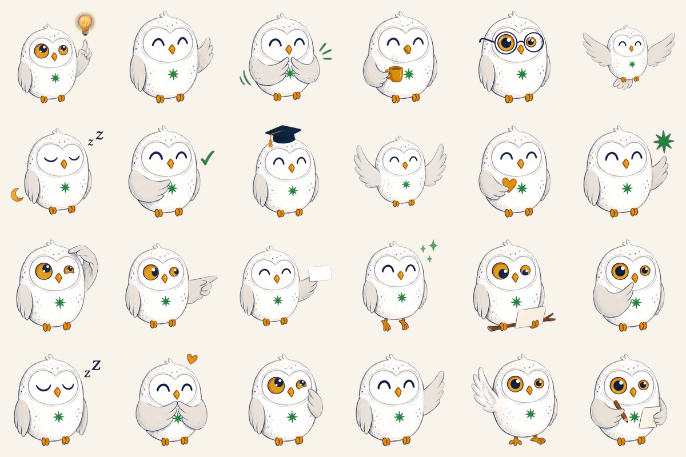
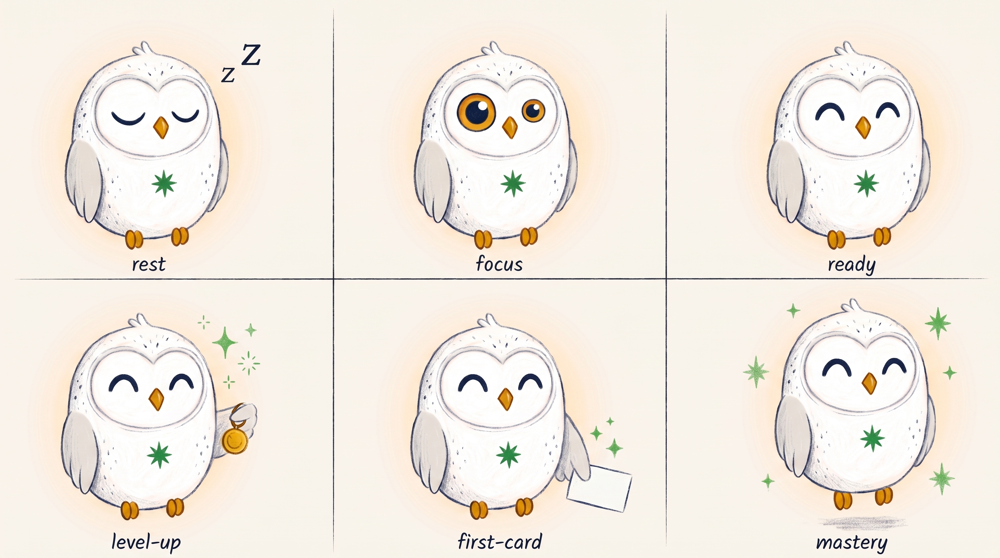
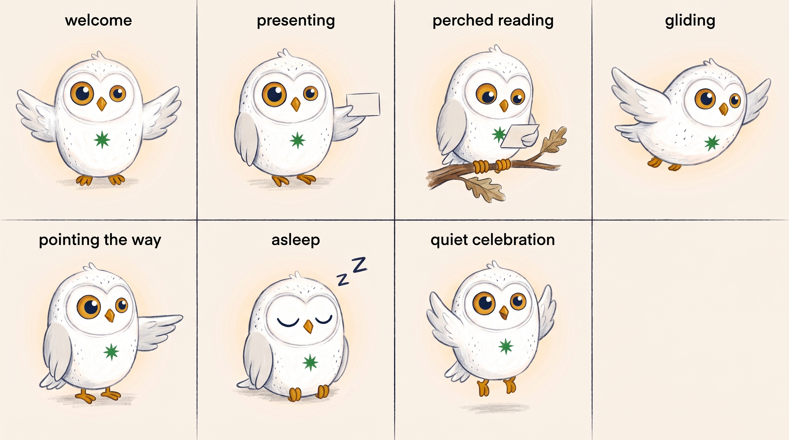

# AI Tutors — ChatGPT & Codex plugin

**English** · [简体中文](README.zh-CN.md)

Install the [aitutors.me](https://aitutors.me) tutors into **ChatGPT** or **Codex**.

This repository contains only the plugin manifest — the tutors themselves run at
`https://aitutors.me/mcp`. Nothing here needs building, and there is no code to run.

---

## What this is

[](https://www.youtube.com/watch?v=w3I3YWmSArM)

*Two minutes on what the tutors do and how a KS3 family uses them.*

---

## Install

### ChatGPT (Work) or the ChatGPT desktop app

1. Open **Plugins** → **Add plugin marketplace**
2. Paste this repository's URL as the **Source**:
   ```
   https://github.com/maggielovelace/aitutors-plugin
   ```
3. Add the marketplace, then **Install** the *AI Tutors* plugin
4. Sign in with your aitutors.me account when prompted

Plugins are available in **ChatGPT Work** on the web and in the desktop app.
They are not available in the Chat tab, the IDE extension, or on mobile.

### Codex CLI

```bash
codex plugin marketplace add https://github.com/maggielovelace/aitutors-plugin
codex plugin add aitutors@aitutors-me
codex mcp login aitutors
```

The last command opens the aitutors.me sign-in page in your browser.

### Without the marketplace

Any MCP client that speaks OAuth can connect directly to:

```
https://aitutors.me/mcp
```

Step-by-step guides: [Claude](https://aitutors.me/install) ·
[ChatGPT](https://aitutors.me/chatgpt) ·
[Claude Code & Codex](https://aitutors.me/agent-setup)

---

## What you get

Mentor runs the daily check-in and hands over to the right subject tutor —
Professors **Pi** (maths), **Quill** (English), **Darwin** (biology),
**Curie** (chemistry), **Newton** (physics), **Harari** (history) and
**Mercator** (geography).

Sessions, flashcards and progress save to the same account as the aitutors.me
parent dashboard, so work done in ChatGPT shows up there.

## Requirements

An active [aitutors.me](https://aitutors.me) subscription. The plugin signs you
in to your existing account; it does not create one.

## Heddy stickers



24 hand-drawn crayon stickers of Heddy, the aitutors.me owl — for iMessage on
iPhone, iPad and Mac. **Heddy Stickers is coming to the App Store.** The
transparent PNGs are in [`stickers/`](stickers/) for personal use in your own
chats ([terms](stickers/LICENSE.md)).

## LEGO Heddy


Heddy as a real, buildable LEGO desk sculpture: **1,446 genuine LEGO elements**, 217 mm
tall, about 1.5 kg. The model is generated in code from the `heddy-ip` product geometry, so
every identity anchor survives: the asymmetric amber eyes (left larger), the diamond beak,
the single tuft and the spark-green star. It is engineered, not a CGI look-alike. All nine
validation checks pass: no parts intersect or float, it builds in step order and comes apart
again, it stands on its own feet (it tips only past 16.7°), and the upper body turns ±20° on a
hidden turntable.

- **Model:** [`heddy-ip/lego/model/heddy.ldr`](heddy-ip/lego/model/heddy.ldr) (opens in Studio,
  LDCad or LeoCAD), parts list [`bom.csv`](heddy-ip/lego/model/bom.csv), validation report
  [`validation.md`](heddy-ip/lego/model/validation.md)
- **Instructions:** an 82-page, 148-step booklet —
  [`heddy-lego-instructions.pdf`](heddy-ip/lego/instructions/heddy-lego-instructions.pdf)
- **Films:** a 45 s 4K hero film, a 29.7 s 9:16 social cut and an 8 s mascot sting —
  [`heddy-ip/lego/video/`](heddy-ip/lego/video/)
- **Design notes** (character analysis, colour mapping, engineering trade-offs, declared
  deviations): [`heddy-ip/lego/README.md`](heddy-ip/lego/README.md)

Part geometry comes from the LDraw.org parts library (CC BY 4.0). Titles are set in
Bricolage Grotesque and IBM Plex Sans (OFL).

## Support

[hello@aitutors.me](mailto:hello@aitutors.me) · [aitutors.me/chatgpt](https://aitutors.me/chatgpt) ·
[YouTube](https://www.youtube.com/@aitutorsme)

---

Claude is our primary platform — new features land there first. Everything the
tutors do works the same on both.

---

## Skills — Heddy IP (brand art)

This repository also ships the **`heddy-ip`** agent skill: generate on-model images,
cutout stickers, and reels of **Heddy**, the aitutors.me snowy-owl mascot, with identity
governance (locked character DNA, frozen reference sheets, templated prompts, a QA gate
with a repair policy). Generation needs a `GEMINI_API_KEY`. Recipes:
[`heddy-ip/COOKBOOK.md`](heddy-ip/COOKBOOK.md).

Whatever the pose, scene, or medium, it is always the same owl: asymmetric amber eyes
(left larger), a small amber diamond beak, the spark-green star badge, the head tuft.
That consistency is the product — the skill exists to make identity drift impossible.

| | |
|:---:|:---:|
|  |  |
| *Feed image — the crayon-storybook rendition* | *Night scene — same DNA, dark ground rules* |

### Ready-made media

A starter media library ships in [`heddy-ip/media/`](heddy-ip/media/): looping GIFs
(motion-DNA animations + reel cuts), standalone SVGs of the moods and fits, the
pilot reel and its block clips as MP4s, and the four style-direction stills. The
full 369-file asset library lives in the team's shared Drive folder.

| | | |
|:---:|:---:|:---:|
|  |  |  |
| *hop (motion DNA)* | *winter snow* | *night reader* |

### What teams use it for

- **Blog & article illustration** — feed it a post; it finds the 3–6 ideas worth a
  picture, writes a shot list, and renders one image per idea with Heddy *performing*
  each concept (never decorating it).
- **Social posts** — feed images (1:1 / 4:5), story and reel covers (9:16 with safe
  zones), OG cards (16:9), X banners — sizes and platform rules are encoded in the skill.
- **Cutout stickers** — transparent-PNG Heddy poses for compositing onto screenshots,
  thumbnails and slides (`--cutout` chroma-keys the background to alpha).
- **Expression & pose sheets** — the moods (rest / focus / ready), the quiet celebration
  set, and the wardrobe items, as labelled grids:

  

  

- **Short reels** — narrated 10-second blocks (voice first, one style key per block,
  a character-fidelity gate per clip), assembled in the edit.
- **Identity repair** — a render with one wrong anchor (a hooked beak, equalised eyes)
  gets a single-target edit, not a redesign.

Every generation conditions on the frozen identity anchor
([`reference.jpg`](heddy-ip/skills/heddy-ip/assets/heddy-storybook/reference.jpg)), and every
delivery passes the QA checklist: thesis test first, then the identity anchors one by one,
then structural integrity.

### Claude Code

```bash
/plugin marketplace add maggielovelace/aitutors-plugin
/plugin install heddy-ip@aitutors-me
```

### Codex CLI

```bash
codex plugin marketplace add https://github.com/maggielovelace/aitutors-plugin
codex plugin add heddy-ip@aitutors-me
```

### Hermes Agent

```bash
git clone https://github.com/maggielovelace/aitutors-plugin /tmp/aitutors-plugin
cp -R /tmp/aitutors-plugin/heddy-ip/skills/heddy-ip ~/.hermes/skills/creative/heddy-ip
hermes skills list | grep heddy-ip
```

Hermes prompts for `GEMINI_API_KEY` on first load (the SKILL.md declares it via
`required_environment_variables`).

### OpenClaw / Pi / any SKILL.md agent

The skill is a self-contained folder — `heddy-ip/skills/heddy-ip/` (SKILL.md +
references + frozen reference sheets + a stdlib-only Python generation script).
Copy it onto the agent's skills path; OpenClaw metadata (emoji, `requires.bins`)
is in the SKILL.md frontmatter, and any agent that reads SKILL.md can use it as-is.

> **Character licence note:** the Heddy character and the reference artwork are
> aitutors.me brand IP. The skill is published so that agents working **for
> aitutors.me** can produce brand assets — it is not a licence to use the
> character for other products. See [LICENSE](LICENSE).

---

## Skills — Flashcards (card authoring)

This repository also ships the **`flashcards`** agent skill: teach an LLM to turn
notes, a textbook page, or a topic into flashcards in **aitutors.me's own format**
— the same format its own tutors and its own kid-facing card composer produce, so
what you get back is accepted by aitutors.me's QA gate on the first try. No API key,
no account, no network call from the skill itself — it produces plain JSON and stops.

Unlike `heddy-ip`, this skill is **format and QA only** — it has no tutoring logic,
no hint-ladder, and no curriculum content of its own. It is published under MIT
(see the "flashcards" carve-out in [LICENSE](LICENSE)) because there's nothing
proprietary in "here is a JSON schema for a flashcard".

### What it teaches

- **Six card kinds**, each with a different job — `basic` (one question, one
  answer), `basic_reversed` (one note becomes two independently-scheduled cards,
  for names and vocab), `type_in` (typed recall, for short exact answers),
  `cloze` (fill one blank), `cloze_multi` (fill several blanks, one card per
  blank, automatically). `image_occlusion` is documented but never authored —
  it's reserved for aitutors.me's own canonical diagrams.
- **The atomic-front rule** — one fact per card, with the same conservative
  multi-fact detector aitutors.me's own QA gate uses, so a front that asks for
  "three organelles" gets split before it ever gets rejected.
- **The hint-leak rule** — a hint may never repeat a word of 4+ letters that's
  also in the answer; the skill writes hints that narrow the search instead of
  spelling out the destination.
- **The exact JSON wire shape** the import screen expects, including the
  8-card-per-batch ceiling and what to do with a bigger set (split it).

Full schema and worked examples: [`flashcards/skills/flashcards/references/card-format.md`](flashcards/skills/flashcards/references/card-format.md).
QA rules restated for a model: [`flashcards/skills/flashcards/references/qa-checklist.md`](flashcards/skills/flashcards/references/qa-checklist.md).

### How to use it

1. Give the agent your source material (paste notes, describe a topic, or point
   it at a textbook page) and ask it to use the `flashcards` skill.
2. It reads the material, splits it into atomic single-fact fronts, picks a
   card kind per fact, checks every hint against the hint-leak rule, and caps
   the batch at 8 cards.
3. It hands back **one fenced JSON block** — nothing else to do on the agent
   side.
4. Take that JSON to **[aitutors.me/study/cards/new/import](https://aitutors.me/study/cards/new/import)**
   (requires an aitutors.me account with an active subject), paste it in, and
   confirm the preview. The cards land straight in your own private practice
   pile — nobody else ever sees them, and they're editable drafts until the
   first time you're graded on one.

Example prompt:

```text
Use the flashcards skill on this page of notes about the water cycle — make
me a set for a Year 8 aitutors.me account, then give me the JSON to import.
```

### Claude Code

```bash
/plugin marketplace add maggielovelace/aitutors-plugin
/plugin install flashcards@aitutors-me
```

### Codex CLI

```bash
codex plugin marketplace add https://github.com/maggielovelace/aitutors-plugin
codex plugin add flashcards@aitutors-me
```

### Hermes Agent

```bash
git clone https://github.com/maggielovelace/aitutors-plugin /tmp/aitutors-plugin
cp -R /tmp/aitutors-plugin/flashcards/skills/flashcards ~/.hermes/skills/education/flashcards
hermes skills list | grep flashcards
```

No environment variables are required — the skill only produces JSON.

### OpenClaw / Pi / any SKILL.md agent

The skill is a self-contained folder — `flashcards/skills/flashcards/` (SKILL.md +
references, no scripts, no assets). Copy it onto the agent's skills path;
OpenClaw metadata (emoji) is in the SKILL.md frontmatter, and any agent that
reads SKILL.md can use it as-is.
