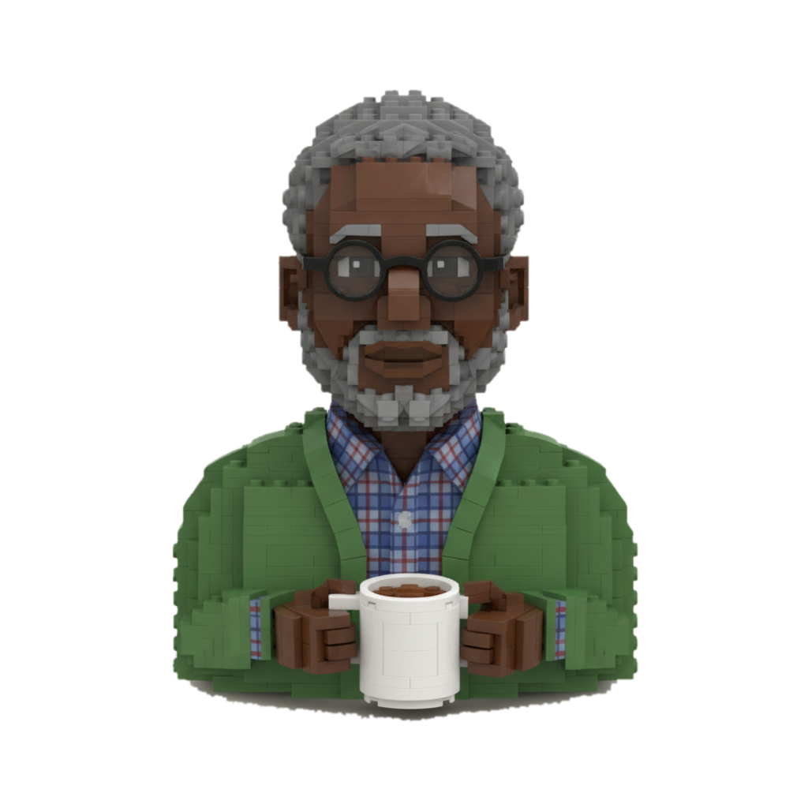
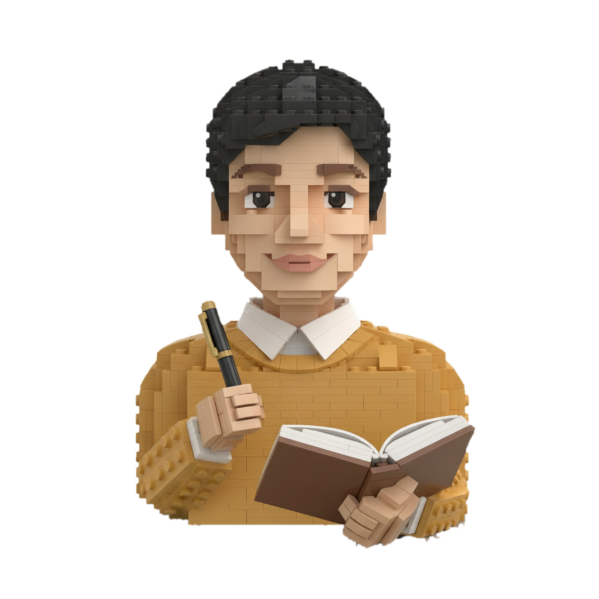
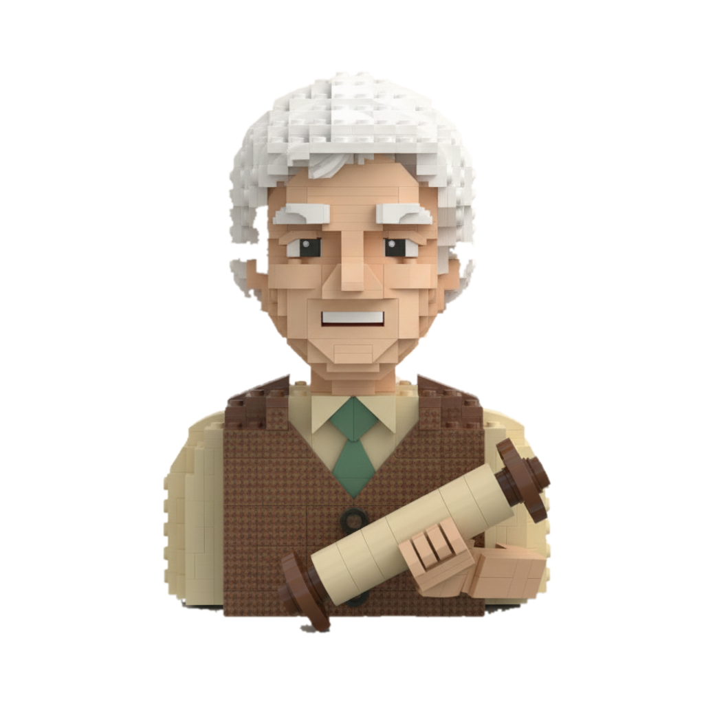
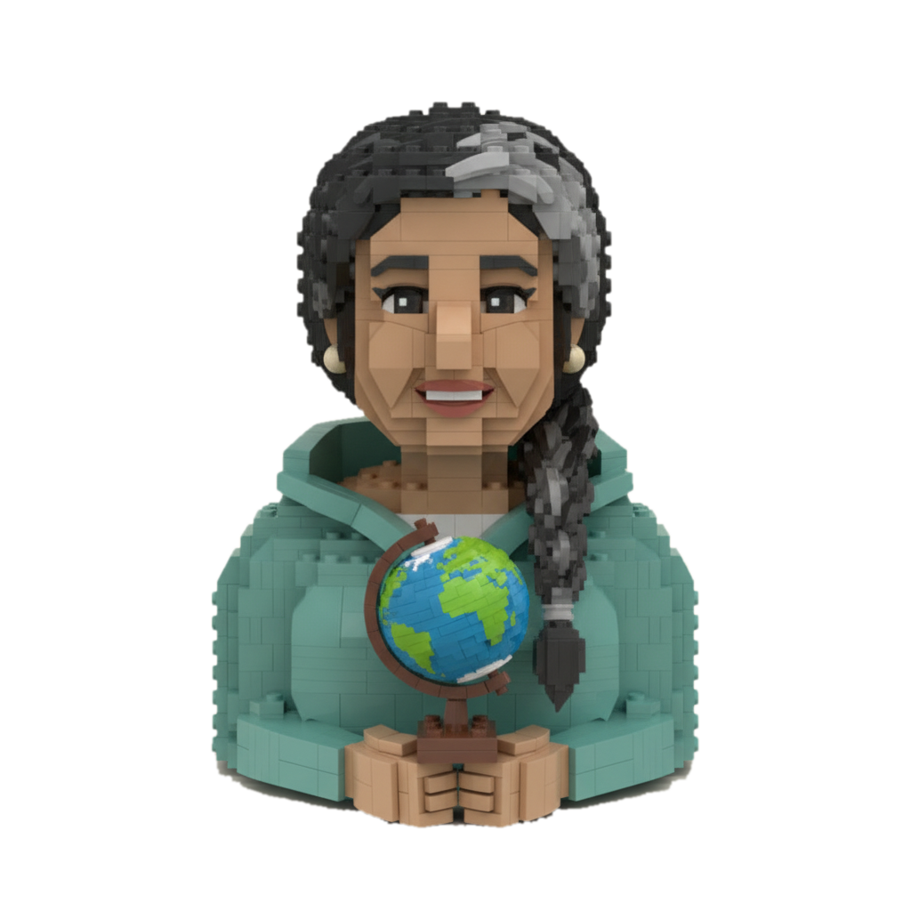
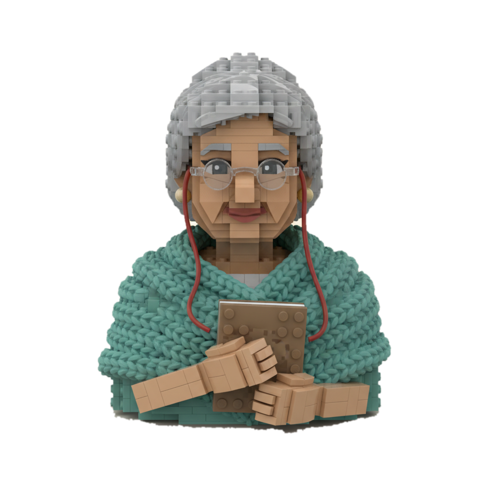

# The brick-built faculty

**English** · [中文](README.zh-CN.md)

The eight AI tutors of [aitutors.me](https://aitutors.me) and the
[Heddy app](https://heddy.app), drawn as brick-built busts so they live in the
same world as [LEGO Heddy](../heddy-ip/lego/README.md). Heddy shows you to the
door; these are the tutors on the other side of it.

| | Name | Subject | Holding |
|---|---|---|---|
|  | **Professor Pi** | Maths | a mug of tea |
|  | **Professor Newton** | Physics | an apple |
|  | **Professor Curie** | Chemistry | safety goggles, pencils in the lab-coat pocket |
|  | **Professor Darwin** | Biology | a magnifying glass and a leaf |
|  | **Professor Quill** | English | a fountain pen and an open book |
|  | **Professor Harari** | History | a rolled scroll |
|  | **Professor Mercator** | Geography | a globe |
|  | **Mentor** | Your week | a notebook, glasses on a cord |

## Files

- `<name>.png` — 1024 × 1024, on the Heddy cream (`#F8F3EB`)
- `cutout/<name>.png` — the same bust with a transparent background
- `faculty-preview.jpg` — all eight on one sheet

## What these are, plainly

- **AI tutors, and labelled as such.** Wherever a portrait appears in the
  product it carries the words "AI tutor". The faces are there to make a
  session feel warm, never to suggest a person is on the other end.
- **Original characters.** The professors' names honour scientists, a
  cartographer and a living historian. None of the faces is a likeness of any of
  them, or of any real person.
- **Generated renders, not buildable models.** Unlike LEGO Heddy, which is a
  real 1,446-piece model built in code, these busts are AI-generated images in a
  brick-built style. They are not LEGO products and have no parts list.

## Use

Personal, non-commercial use only; see [LICENSE.md](LICENSE.md).
