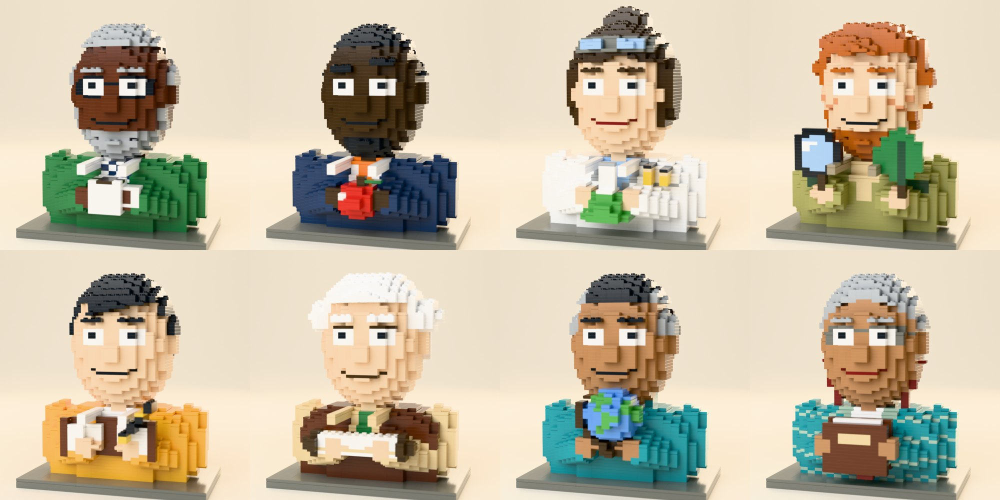

# The brick-built faculty, built from real bricks

**English** · [中文](README.zh-CN.md)



The eight aitutors.me AI tutors as brick busts **engineered in code from real LDraw parts**,
the same way [LEGO Heddy](../../heddy-ip/lego/README.md) was made, and rendered in Heddy's
own studio (same plastic, bevels, lights and sweep). Each bust is 1,400–1,600 plates and tiles.

This is **version 2**. Version 1, painted by an image model, is in [`../`](../README.md).
Both are kept.

This folder is a **toolkit**, not just a set of pictures. Any agent (or person) can rebuild a
professor, render a new angle, cut them out on a transparent background, or add a new
character that sits in the same set.

## What's here

| Path | What |
|---|---|
| `renders/<id>.png` | 1200 × 1200 portrait on the Heddy cream sweep |
| `renders/cutout/<id>.png` | the same shot with a transparent background (plinth kept, no floor) |
| `model/<id>.json` | the parts list the renderer reads (LDraw part, colour, position, rotation) |
| `model/<id>.ldr` | standard LDraw file. Opens in Studio, LDCad or LeoCAD, one step per plate layer |
| `tools/bust.py` | the builder: voxel field → hollow shell → real plates and tiles → `.json` + `.ldr` |
| `tools/prof_<id>.py` | one spec per character (face, hair, clothes, the object they hold) |
| `tools/render_bust.py` | renders a model with Heddy's studio (`../../heddy-ip/lego/tools/scene.py`) |
| `tools/build.py` | one command to rebuild and render one professor or all of them |
| `sheet.jpg` | all eight on one sheet |

Ids: `pi`, `newton`, `curie`, `darwin`, `quill`, `harari`, `mercator`, `mentor`.

## Setup (once)

Building a model needs only Python 3. Rendering needs Blender as a Python module, which needs
**Python 3.11** (tested with `bpy` 5.0.1):

```bash
conda create -y -p ./bpyenv python=3.11          # or any Python 3.11 venv
./bpyenv/bin/pip install bpy numpy pillow
export BPY_PYTHON=$PWD/bpyenv/bin/python
```

No Blender app is needed, and the LDraw part geometry is already in the repo
(`heddy-ip/lego/ldraw`, CC BY 4.0).

## Commands (run from the repo root)

```bash
python3 faculty/built/tools/build.py all                     # rebuild every model (.json + .ldr)
python3 faculty/built/tools/build.py pi --render             # rebuild Pi, render renders/pi.png
python3 faculty/built/tools/build.py all --render --cutout   # everything, both shots

# one-off renders
$BPY_PYTHON faculty/built/tools/render_bust.py faculty/built/model/pi.json out.png \
    --size 700 --samples 24            # quick draft (seconds)
$BPY_PYTHON faculty/built/tools/render_bust.py faculty/built/model/pi.json pi-left.png --rot 30
$BPY_PYTHON faculty/built/tools/render_bust.py faculty/built/model/pi.json pi-cut.png --cutout
```

A quick draft renders in seconds. A full-quality render (1200 px, 64 samples) takes a few minutes on a laptop CPU, longer if the machine is busy.

## How the builder works

A bust is a voxel field at real brick resolution: **one cell = 1 stud (20 LDU) wide × 1 stud
deep × 1 plate (8 LDU) tall**. Coordinates are in LDU, with X to the right, Y up and Z toward the viewer.

- `b.fill(pred, colour, tag)` sets every cell whose centre satisfies `pred(x, y, z)`.
  Helpers: `ell` (ellipsoid), `box`, `cyl_y`, `cyl_z`, and a `capsule` for limbs in the specs.
- `b.recolour(pred, colour, tags=…)` repaints existing cells (patterns, collars, hair on the head).
- `b.paint_front(pred2d, colour, tags=…, depth=1)` paints the **frontmost** cells of each column.
  This is how faces are drawn: eyes, mouth, glasses, beard.
- `b.bump_front(pred2d, colour, n=1)` adds cells in front: nose, brows, a chin.
- `b.to_parts(studded=(HAIR,))` hollows the model to a 2-cell shell. It then merges each plate layer
  greedily into the largest real plates that fit, with **tiles** on exposed tops (smooth) and studs kept
  on hair (texture). Only parts in Heddy's vendored library are used.
- `save(parts, 'model/<id>.json', meta)` writes the JSON and the `.ldr` beside it.

## The set lock: keep these, or it stops matching

Every professor shares these, and so must any new character or asset:

| | Value |
|---|---|
| Head | `ell(0, 334, 8, 130, 166, 118)`: 13 studs wide, 41 plates tall |
| Torso, neck, ears, arms | copy the functions in `prof_pi.py` unchanged |
| Eyes | 3-stud white with a 1-stud, 2-plate black pupil, centred |
| Brows / nose | a 1-cell forward bump |
| Plinth | colour 72, 3 plates, the whole bust shifted up 3 plates (end of each spec) |
| Camera | height **0.11149 m**, 85 mm lens, turntable **−16°**. The render script defaults to this |
| Final render | 1200 px, 64 samples, bg `EFE8DA`, floor `F4EEE3` |

The camera is fixed on purpose: a taller model (Curie's bun) must not move the camera, or she
would sit higher than the others.

## Adding a new character

1. Copy `tools/prof_pi.py` to `tools/prof_<id>.py` and add the id to `FACULTY` in `tools/build.py`.
2. Change **only** skin, hair, facial hair, glasses, mouth, clothes and the one object they hold.
   Give each character a single signature object held at the chest, as the eight do.
3. Draft at `--size 700 --samples 24`, **look at every render**, fix it, repeat (the eight took 4–8 drafts each).
4. Render the final and a cutout: `build.py <id> --render --cutout`.

**Quality bar, learned building the eight:**
- A light colour directly above a dark mouth line reads as **teeth**. Keep a plain skin row, or
  drop the moustache (Pi's fix).
- A heavy black frame across both eyes reads as a **visor**. Use thin frames, or only the top and outer rows.
- Check that the object still reads against the clothes. Tan paper vanished on tan sleeves
  (Harari's scroll is white), and a white flask neck vanished on a white coat.
- A brown lens rim reads as a hand mirror. Darwin's magnifier rim is black.

**Colours:** official LDraw codes only. Those used here: 15 white, 0 black, 71/72 greys, 78/92/84
nougats, 70 reddish brown, 308 dark brown, 19 tan, 28 dark tan, 2/10/288 greens, 330 olive, 272
dark blue, 73 medium blue, 212 light blue, 3 dark turquoise, 378 sand green, 4 red, 320 dark red,
25 orange, 484 dark orange, 14 yellow, 191 bright light orange. To add one, extend the colour
table in `render_bust.py` with its LDConfig hex.

## Making new assets from the same models

- **Other angles / a turntable:** `--rot` in steps (e.g. −60…60) and stitch the frames.
- **Expressions:** copy a spec and change only the face lines. A blink is the eye cells painted
  in skin colour with a one-plate lash line. A bigger smile moves the mouth corners up one plate.
  Keep the set lock.
- **Stickers, avatars, web:** use `renders/cutout/`. For small sizes crop to the head, then
  downscale. Don't upscale.
- **Physical builds:** the `.ldr` opens in Studio. Note: unlike LEGO Heddy, these models have
  **not** been checked for stability or buildability (no connection or collision
  validation). They are made of real parts, but treat them as render models first.

## Rules for every asset

- **AI tutors, labelled as such.** Wherever a portrait appears in the product it carries
  "AI tutor" ("AI 导师"). The faces are for warmth, never to suggest a person is on the other end.
- **Original characters.** The names honour real people. No face may resemble them or anyone real.
- **Each professor's gender matches their namesake** (owner rule): Curie and Mentor are women, the
  other six are men.
- **"Brick-built", never "LEGO"** in anything public-facing. LEGO is a trademark.
- **No teaching-method detail** in this repository. Names, subjects and objects only.

Licence: see [`../LICENSE.md`](../LICENSE.md). Personal, non-commercial use of the artwork. Part
geometry: LDraw.org, CC BY 4.0.
