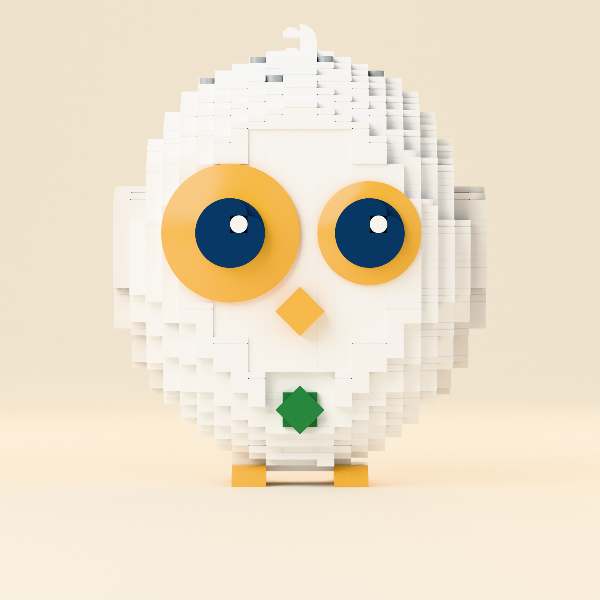

# 乐高海迪（LEGO Heddy）—— 经过工程验证的桌面雕塑

[English](README.md) · **中文**

一件真的能拼出来的乐高海迪。它由
[`../skills/heddy-ip/references/heddy-dna.md`](../skills/heddy-ip/references/heddy-dna.md)
里锁定的角色身份和故事书三视图推导而来。流程参照 Microduck 的做法：
**IP 参考 → 角色分析 → 积木工程 → 验证模型 → 拼装顺序 → 说明书 → 影片**。模型由代码
生成，使用真实的 LDraw 零件几何。所有渲染图和拼装步骤都来自同一个锁定文件：
[`model/heddy.json`](model/heddy.json)（LDraw 格式：[`model/heddy.ldr`](model/heddy.ldr)，
可用 Studio、LDCad、LeoCAD 打开）。

| | |
|---|---|
| 零件数 | **1,446**（94 种零件/颜色组合，50 种零件设计） |
| 尺寸 | 176 × 217 × 142 mm（宽 × 高 × 深），约 1.5 kg |
| 拼装 | 9 个阶段，共 148 步 |
| 校验 | 9 项全部通过（[`model/validation.md`](model/validation.md)） |



## 1. 角色分析（来自 `heddy-ip`）

海迪是**一个**柔软的蛋形：头和身体是同一个整体，没有脖子。下表逐条对应 13 个锁定锚点。
所有取舍都按简报的识别优先级来定：轮廓 → 脸 → 眼睛 → 颜色 → 比例 → 翅膀 → 脚。

| 锚点 | 来源 | 乐高实现 |
|---|---|---|
| 1 轮廓 | 产品路径，72 × 89 单位 | 按精确贝塞尔路径切成 62 层板；身体宽 20 颗凸点（1 个 IP 单位 = 5.57 LDU = 2.23 mm） |
| 2 一撮呆毛 | `M55.5 18 Q60 8.5 64.5 18` | 一块*弧顶砖 2×1×1⅓*（6091），像参考图一样微微偏向一侧 |
| 3 白色身体 | `#FFFFFF` | 白色，是画面里最白的东西 |
| 4 面盘 | 淡淡的第二道轮廓 | 身体正面压平成猫头鹰的面盘；凸点朝前的脸板比它低 1.6 mm，所以面盘只是一道淡淡的阴影线，不像面具 |
| 5 **不对称的眼睛** | 虹膜半径 13.5 对 11 | **8×8 碟**对 **6×6 碟**（比例 1.33 对 1.23，已是最接近的真实尺寸；左眼明显更大） |
| 6 瞳孔 + 一个高光 | 墨色瞳孔约为虹膜一半，高光在右上 | 大地蓝 4×4 圆板 + 三块四分之一圆砖片；第四个象限放**一块**白色 1×1 圆砖片，位于右上对角线 |
| 7 没有眉毛、鼻子、腮红、嘴 | — | 都没有。有一条脸板接缝看起来像嘴，已通过工程手段消除（脸板边缘与板层对齐） |
| 8 琥珀色菱形嘴 | 旋转 45° 的正方形 | 2×2 板借助跳板的单个中心凸点转成 45° |
| 9 短短的侧翼 | `#ECEBE5`，长在身体两侧，y 54–99 | 浅石灰色的叶形，直接砌进侧面的板层，比身体凸出一颗凸点 |
| 10 琥珀色肉垫脚 | 两个椭圆，没有爪子 | 琥珀色板 + 每只脚两块*弧形斜砖 2×1* 作脚趾 |
| 11 绿色八角星 | 肚子上，半径约 7 | 两块深绿色正方形错开 45°（2×2 跳板 + 转过的 2×2 砖片） |
| 12 约 7 个斑点 | 低透明度墨色 | 7 块中石灰色 1×1 圆砖片，分布在头顶和侧上方 |
| 13 其他一律没有 | — | 身上没有其他东西 |

简报要求"眉毛造型"，但 IP 优先：锚点 7 禁止眉毛，而 heddy-dna 的优先级规定身份锚点高于
临时要求。海迪的表情来自不对称的眼睛和高光。

## 2. 配色映射

用 CIEDE2000 在官方 LDraw 颜色表里找最接近的乐高颜色，只考虑目前仍在生产的颜色：

| 海迪色 | 色值 | 乐高颜色（编号） | LDraw | ΔE00 | 用在 |
|---|---|---|---|---|---|
| 身体白 | `#FFFFFF` | White（1） | 15 | 0.0 | 身体、脸、呆毛 |
| 翅膀 | `#ECEBE5` | Light Stone Grey（208） | 151 | 2.6 | 翅膀 |
| 琥珀 | `#DC9400` | Flame Yellowish Orange（191） | 191 | 10.3 | 虹膜、嘴、脚 |
| 深墨 | `#00173B` | Earth Blue（140） | 272 | 9.1 | 瞳孔 |
| 火花绿 | `#238744` | Dark Green（28） | 2 | 4.6 | 肚子上的星 |
| 墨色 25%（斑点） | `#BFC5CE` | Medium Stone Grey（194） | 71 | 9.1 | 斑点、内部结构 |

关于琥珀色：Earth Orange（ΔE 6.6）和 Bright Yellowish Orange（7.0）更接近，但都已停产。
Flame Yellowish Orange 是目前生产的琥珀色，本模型用到的每种零件都有这个颜色。内部结构用
中石灰色，和斑点同色，所以调色板里没有多出颜色。转盘是深石灰色，从外面看不到。

## 3. 工程

* **外壳**：每一层板都是轮廓的横截面（深度 = 宽度 × 0.9，取自侧视图），栅格化到凸点网格。
  外壳两颗凸点厚、内部中空，五层整板把各圈连在一起。
* **砖层**：接近竖直的中段使用三层高的砖层，节奏是每五层一次。这个节奏正好对上脸部的侧装
  （SNOT）行：侧凸点在砖底上方 14 LDU，所以每 5 层板（= 2 颗凸点）重复一次。
* **台阶面**：头顶露出的台阶面都铺砖片，表面没有凸点；真正的轮廓转角用四分之一圆砖片。
* **脸**：凸点朝前的脸板（板 + 砖片表皮）扣在*侧面带凸点的 1×4 / 1×2 / 1×1 砖*上。
  眼睛依次叠上去：垫高圆板 → 雷达碟（虹膜）→ 4×4 圆板（瞳孔）→ 砖片。
* **转盘**：一个隐藏的 4×4 转盘在脚上方把身体分成上下两部分。上半部分（整板 + 挂在它下面
  的三圈）倒过来拼好，再压到转盘上。影片里海迪转向笔记本，靠的就是它。按 IP 要求，头和
  身体仍是一个整体，所以没有脖子关节，也不会歪头。
* **脚**：两块 2×8 板从脚尖伸到脚跟，由一块 4×8 底板连起来。整座模型只靠双脚站立，不需要支架。

### 校验（全部通过 —— [`model/validation.md`](model/validation.md)）

有向包围盒分离轴碰撞检测 · 凸点/凹孔连接图（没有悬空零件，整体连成一个结构）· 拼装顺序
（每个零件都能连到已拼好的部分，并沿插入方向滑入，不穿过任何零件）· 按相反顺序拆解 ·
重心高 105.8 mm，落在双脚支撑多边形内，余量 31.7 mm（倾斜超过 16.7° 才会倒）·
上半身转动 ±20° 不碰任何东西。

### 零件数

1,446 块超出了简报 600–1,200 的参考范围，但零件数没有灌水。约 310 块是内部结构：要让一个
22 cm 高的中空雕塑外壳能按顺序拼起来，就需要内圈、整板层和底部的悬挑锚点。把砖层减薄到
一颗凸点只省 56 块，却让 23 项拼装顺序检查失败；去掉整板层反而让零件数*增加*。两个方案
都实际测过，都放弃了。

## 4. 已声明的偏差

1. 虹膜比例是 1.33 而不是 1.23：这是最接近的真实碟子尺寸。
2. 高光位于右上对角线、瞳孔半径的 0.35 倍处（IP 为 0.77）；位置由凸点决定。
3. 肚子上的星由两个正方形组成，所以比 IP 里细长的星角更宽；八个角和颜色都准确。
4. 斑点是 8 mm 的圆点，比 IP 里的细线大；一共 7 个。
5. 所用的 LDraw 零件库子集缺少 9 种真实零件（98138、60474、87580、25269、27925、11477、
   87087、11211、3403c01），它们的几何按真实尺寸自行建模，底部细节做了简化。

## 5. 影片

三段视频都从锁定的 `model/heddy.json` 渲染（先 `tools/render_film.py`，再
`tools/make_film.py`）。每个零件都沿自己的插入方向移动，在落位那一帧"咔哒"扣上。成品模型上
唯一会动的，是真实的转盘。

| 文件 | 规格 | 内容 |
|---|---|---|
| `video/heddy-lego-hero-16x9-4k.mp4` | 45 秒，3840×2160，24 fps | 十个镜头的分镜：一块砖 → 拼装 → 脸 → 完整亮相 → 爆炸图 → 说明书 → 转向问题卡 → 品牌 |
| `video/heddy-lego-social-9x16.mp4` | 29.7 秒，1080×1920 | 竖版重剪，逐镜头裁切 |
| `video/heddy-lego-sting-16x9-4k.mp4` | 8 秒，3840×2160 | 眼睛扣上 → HEDDY / heddy.app |

画面先用 Cycles 在 CPU 上渲染为 1920×1080（10 采样 + OpenImageDenoise），再用 Lanczos 放大到
4K。9:16 版从同一批画面裁出，定格动画镜头按"一拍二"制作。字幕使用 Bricolage Grotesque 和
IBM Plex Sans（OFL，见 `tools/fonts/`）。声音是合成的：每个零件落位一声轻响、一段安静的
A 大七和弦铺底，以及标志出现时的一声钟音。

## 6. 文件

```
model/        heddy.json（锁定）、heddy.ldr、heddy_steps.json、bom.csv/.md、validation.json/.md、
              heddy-factory-bom.csv + factory-handoff.md（交给工厂）
renders/      正/背/左/右视图、hero-3q、hero-4k（最终主视觉）、爆炸图、带标注的爆炸图
video/        主片、9:16 竖版、片头
instructions/ heddy-lego-instructions.pdf（pages/ 和 steps/ 可重新生成，不提交）
tools/        build_heddy.py → sequence.py → validate.py → make_bom.py → render_* → make_booklet.py
ldraw/        LDraw 零件库子集（CC BY 4.0，见 lib/CAreadme.txt）+ 自建零件
```

全部重建：`pip install bpy numpy pillow imageio-ffmpeg`，按上面的顺序运行各工具，再运行
`render_film.py` 和 `make_film.py` 生成影片。
